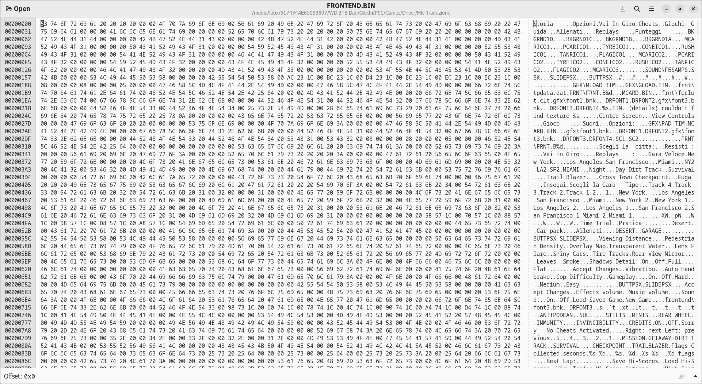
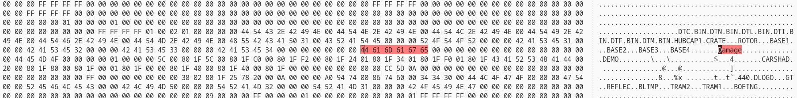
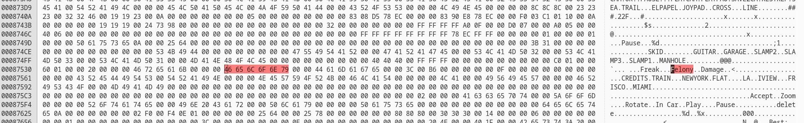
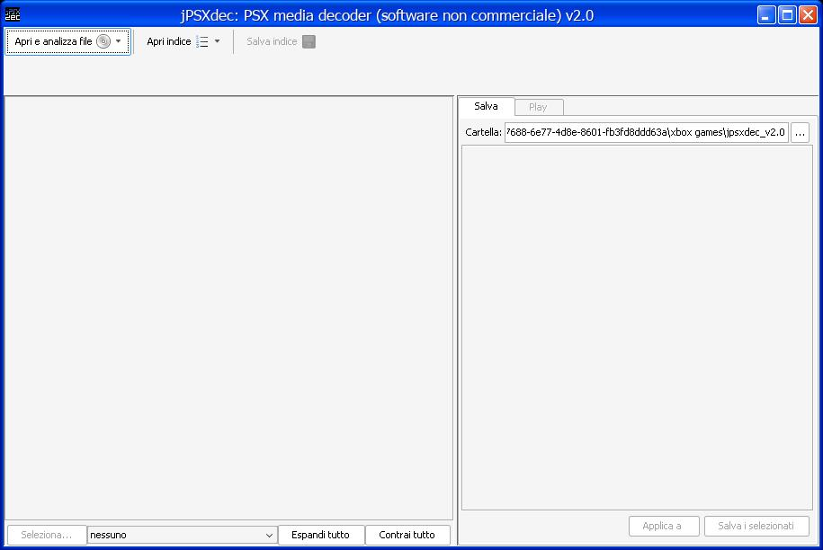
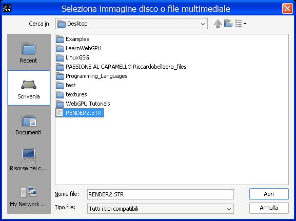
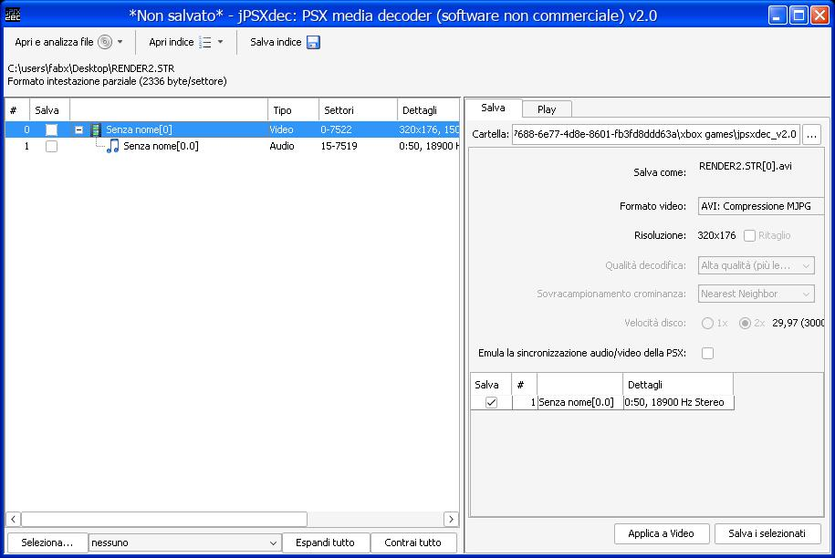
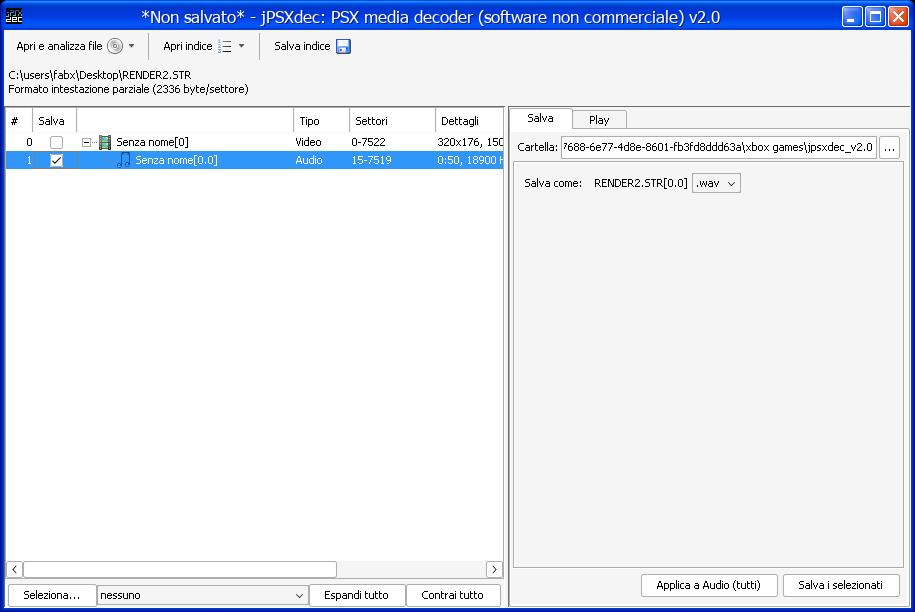

# Files to translate UI

`FRONTEND.BIN` Contains menu text.

NOTE: Strings must be the same lenght or shorter. If you type too many bytes for a string the game will crash! usually the delimiter in each string is a the last dot. 

if you need less chars, you can remove the remaining bytes with spaces.

`XA` contains dialogue voices.

`SOUND/VOICES.BLK` contains voices for the NPCs.

`IVIEW.BIN` Contains "Undercover" menu strings.

`MCCARD.BIN` Contains "Memory Card" save game strings

`DATA/LANG.ENG` Contains main menu and some in game text strings.

NOTE: LANG.ENG can accept a bit longer strings, but not too much or you won't see it in game!

`NFMV` Video cutscenes with the audio. PAL version has `FMV` folder.

`SLUS_008.42` Contains Damage, Felony and pause menu strings.


# Hex Editing BIN files

you'll need a hex editor. The data is not encrypted so it's easy to see what string you have to change.

Example:



# Felony, Damage and pause menu Text

in `SLUS_008.42`

Damage hex bytes:



Felony and extra damage hex bytes:




NOTE: Felony can have one extra char, as long you don't go over "Damage"

The other menu text are in the same file, just search in the hex the corresponding chars you want to replace and you'll find them.


# STR Modding: change audio language

First you need to get the driver disc that contains the language that you want.

Get mkpsxiso: https://github.com/Lameguy64/mkpsxiso

then use `mkpsxiso` tool to extract ISO files from bin/cue with this command:

`dumpsxiso -s nameof.xml "Name of file.bin"`

this will dump the psx iso files and generate a xml file for the data structure.

do it for both the games since we need both game versions extracted.


now we need `JPSXDEC`: https://github.com/m35/jpsxdec

open `jpsxdec` and click on `open or analyze file`



go into `NFMV` folder here you'll have folders from `0-7`.

Select one of the `RENDERx.STR` files



now you'll have a little + sign, if you expand you can notice that you can select a video and the audio.



export the `video` only for the USA driver, and the `audio` only for the native language you want.

you can select via this tiny little check box on the left:



Video must be `.avi`, audio must be `.wav`

Now, for this tutorial i used shotcut, but you can use any video editor.

Import the avi into the editor, detach the audio channel and remove the original audio track

import the extracted wav audio file and align it to the original track

export with these options:

`MPEG codec`

`video: 320x176`

`FPS: 29,970030` (on shotcut it's auto-detected.)


audio:

`18900Hz pcm_s16le`

`constant 256kb bitrate`


Now we have our avi to import into the STR.

# Avi2STR Step

i provided a script that uses `PsxAvEnc.exe` and adapter its parameters to driver 1 needs.

However, if you're on windows you'll have to manually make it recursive to convert all avis into STRs.

here's the basic command line:

`PsxAvEnc.exe -t str2 -f 18900 -b 4 -c 2 -s 320x176 -I -r 30 -x 2 "input.avi" "output.str"`

# Linux Script

```
# place your avi files in a folder called input.
cd Input;

for folder in *; do cd "$folder";

for file in *.avi; do wine start "Z:\\\\path\\to\\AVI2STR\\PsxAvEnc.exe" -t str2 -f 18900 -b 4 -c 2 -s 320x176 -I -r 30 -x 2 "$file" "$file".str;

done;

cd ..;

done
```


After converting the avi into STR, replace it where you got and test in game. 

THe first undercover cutscene to test with is `NFMV/0/RENDER2.STR`

# Command Explaination

`-t str2`  - specifies STR method

`-f 18900` - Hertz frequency

`-b 4` 	   - sets audio at 4 bit, max is 8 for STR.

`-c 2`     - two channels stereo.

`-s x-y`   - resolution

`-I`	   - should be interlaced (?)

`-r 30`    - sets FPS for video.

`-x 2`	   - ??

`input`

`output`


# ISO Rebuilding

`mkpsxiso file.xml -o "Name of .iso`

gives the generated xml file to mkpsxiso and will output to a PSX ISO, that you can test in the emulator.
